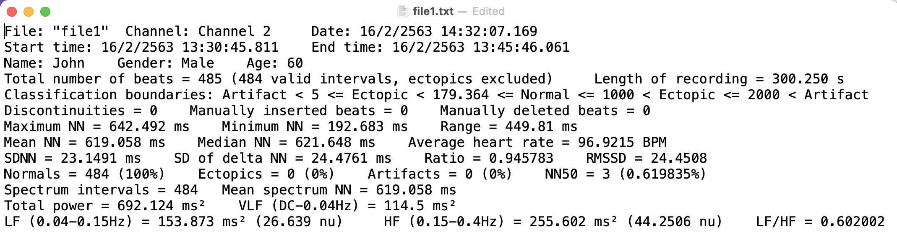

<!-- README.md is generated from README.Rmd. Please edit that file -->

```{r, include = FALSE}
knitr::opts_chunk$set(
  collapse = TRUE,
  comment = "#>",
  fig.path = "man/figures/README-",
  out.width = "100%"
)
```

# labChartHRV <a href="https://lightbridge-ks.github.io/labChartHRV/"></a>

<!-- badges: start -->

[](https://lifecycle.r-lib.org/articles/stages.html#experimental) [](https://github.com/Lightbridge-KS/labChartHRV/actions/workflows/R-CMD-check.yaml) [](https://app.codecov.io/gh/Lightbridge-KS/labChartHRV?branch=main)

<!-- badges: end -->

> **R package :package: for LabChart's Heart Rate Variability Data**

# Overview

`{labChartHRV}` is an R package which contains functions for data import and manipulation of [LabChart's HRV module](https://www.adinstruments.com/products/hrv).

**Use case**

-   Import and transform LabChart's HRV report file (`.txt`) into a tibble (data frame).

# Installation

You can install the development version of labChartHRV from [GitHub](https://github.com/) with:

-   Install `{remotes}` package by (skip If you already have):

``` r
install.packages("remotes")
```

-   Install `{labChartHRV}` package by:

``` r
remotes::install_github("Lightbridge-KS/labChartHRV")
```

# Problems

This is a LabChart's HRV report file (`.txt`) of 1 subject.



How to transform it into a 1-row **data frame** for further analysis?

Moreover, If we have multiple of these text files, how can we transform it into a data frame which has each rows corresponding to each subjects?

`{labChartHRV}` package has functions to solve this problems

# Usage

```{r}
library(labChartHRV)
```

This package comes with example data of LabChart's HRV report file(s) in `.txt`.

```{r path_hrv}
# Path to a folder containing example HRV report text files
path_hrv <- labChartHRV_example("HRV")
dir(path_hrv)
```

Read HRV report file(s) from `.txt` to a data frame by calling `read_HRV_reports()` with path to either single HRV report or folder containing multiple reports.

```{r hrv_tbl}
# Read multiple HRV report files from a folder
hrv_tbl <- read_HRV_reports(path_hrv)
hrv_tbl
```

`hrv_tbl` is a **tibble** (data frame)

-   **Columns** are *variables* including the results from time-and frequency-domain HRV analysis.

-   **Rows** corresponding to *report files* (i.e., each subjects).

```{r}
# Variable names
names(hrv_tbl)
```

Variable's description are store in this data frame:

```{r}
HRV_vars_desc
```

# Learn more

-   [Get started using labChartHRV](https://lightbridge-ks.github.io/labChartHRV/articles/labChartHRV.html)

# Collaboration

If you want to collaborate to add more function to this package, feel free to contact me at [kittipos.sir\@mahidol.edu](mailto:kittipos.sir@mahidol.edu).

------------------------------------------------------------------------

Last updated: `r Sys.Date()`
