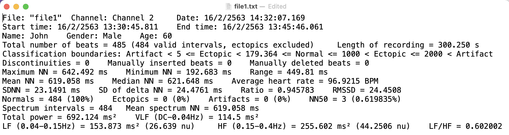

<!-- README.md is generated from README.Rmd. Please edit that file -->

# labChartHRV

<!-- badges: start -->

[](https://lifecycle.r-lib.org/articles/stages.html#experimental)
[](https://github.com/Lightbridge-KS/labChartHRV/actions/workflows/R-CMD-check.yaml)

<!-- badges: end -->

> **R package :package: for LabChart’s Heart Rate Variability Data**

# Overview

**`{labChartHRV}`** is an open-source software package written in [R
programming language](https://www.r-project.org).

It is an R package which contains functions for data import and
manipulation of [LabChart’s HRV
module](https://www.adinstruments.com/products/hrv).

**Functionality**: currently there is 1

-   Import and transform LabChart’s HRV report file (`.txt`) into a
    tibble (data frame).

(If you want to collaborate and add more functions, please contact me at
<kittipos.sir@mahidol.edu>)

# Installation

You can install the development version of labChartHRV from
[GitHub](https://github.com/) with:

-   (If you haven’t already), install `{remotes}` package by:

``` r
install.packages("remotes")
```

-   Install `{labChartHRV}` package by:

``` r
remotes::install_github("Lightbridge-KS/labChartHRV")
```

# Usage

``` r
library(labChartHRV)
```

`{labChartHRV}` contains simulated example data that can be accessed by
`labChartHRV_example()`.

``` r
# Show example data that available in this package
labChartHRV_example()
#> [1] "HRV"
```

Currently, there is 1 type of example data which is LabChart’s HRV
report file.

## Module 1: Read LabChart’s HRV Report

> This module reads and transforms **LabChart’s HRV report file**
> (`.txt`) into a **tidy tibble** with 1 subject per rows.

### Introduction

After exported LabChart’s HRV of 1 subject into a report text file, it
should look like this:



As you can see, the text file is slightly formatted and store data in
key-value pairs (mostly).

> How to transform it so that a data analysis can be performed?

To process this data for further analysis, one approach is to convert it
to a table-like data structure which, in `R`, is a **data frame** (or
[tibble](https://r4ds.had.co.nz/tibbles.html)). The design of this data
frame should be [**tidy**](https://r4ds.had.co.nz/tidy-data.html),
meaning column names are variables, and each rows represent a single
subject. (As in this example, it should be converted to a 1 row data
frame.)

It takes time and effort to manually transforms this into a table which
can be even harder when the number of subject grows.

Functions in this module will **automate** this process.

### Read HRV report file

`read_HRV_reports()` read and transform LabChart’s HRV report file
(`.txt`) to a tidy tibble.

The first argument (`file`) is a **path** to either *single* HRV report
file or *folder* containing multiple HRV report file, the latter case
should be more useful to you.

``` r
# Path to a folder containing example HRV report text files
path_hrv <- labChartHRV_example("HRV")
path_hrv
#> [1] "/Users/kittipos/Library/R/x86_64/4.1/library/labChartHRV/extdata/HRV"
```

There are 4 HRV report `.txt` files in this folder.

``` r
dir(path_hrv)
#> [1] "file1.txt" "file2.txt" "file3.txt" "file4.txt"
```

Now, just supply the path to the folder.

``` r
# Read In
hrv_tbl <- read_HRV_reports(path_hrv)
hrv_tbl
#> # A tibble: 4 × 41
#>   doc_id    File_LabChart Channel   Date  Start_time End_time Name  Gender   Age
#>   <chr>     <chr>         <fct>     <chr> <chr>      <chr>    <chr> <fct>  <int>
#> 1 file1.txt file1         Channel 2 16/2… 16/2/2563… 16/2/25… John  Male      60
#> 2 file2.txt file2         Channel 2 26/3… 26/3/2563… 26/3/25… Max   Male      56
#> 3 file3.txt file3         Channel 2 19/8… 19/8/2563… 19/8/25… Mary  Female    65
#> 4 file4.txt file4         Channel 2 10/9… 19/10/256… 19/10/2… Tom   Female    63
#> # … with 32 more variables: Beats_tot <dbl>, Rec_length <dbl>,
#> #   Class_bound <chr>, Discontinuities <dbl>, Beats_inserted <dbl>,
#> #   Beats_deleted <dbl>, NN_max <dbl>, NN_min <dbl>, NN_range <dbl>,
#> #   NN_mean <dbl>, NN_median <dbl>, HR_avg <dbl>, SDNN <dbl>, SD_del_NN <dbl>,
#> #   RMSSD <dbl>, Normals_count <dbl>, Ectopics_count <dbl>,
#> #   Artifacts_count <dbl>, NN50_count <dbl>, NN50_percent <dbl>,
#> #   Spec_intv <dbl>, Spec_mean_NN <dbl>, Power_tot <dbl>, VLF_freq <chr>, …
```

`hrv_tbl` has 41 columns and 4 rows. Column names correspond to each
fields of the HRV report, and each rows correspond to each HRV report
files.

``` r
# Column Names
names(hrv_tbl)
#>  [1] "doc_id"          "File_LabChart"   "Channel"         "Date"           
#>  [5] "Start_time"      "End_time"        "Name"            "Gender"         
#>  [9] "Age"             "Beats_tot"       "Rec_length"      "Class_bound"    
#> [13] "Discontinuities" "Beats_inserted"  "Beats_deleted"   "NN_max"         
#> [17] "NN_min"          "NN_range"        "NN_mean"         "NN_median"      
#> [21] "HR_avg"          "SDNN"            "SD_del_NN"       "RMSSD"          
#> [25] "Normals_count"   "Ectopics_count"  "Artifacts_count" "NN50_count"     
#> [29] "NN50_percent"    "Spec_intv"       "Spec_mean_NN"    "Power_tot"      
#> [33] "VLF_freq"        "VLF"             "LF_freq"         "LF"             
#> [37] "LF_nu"           "HF_freq"         "HF"              "HF_nu"          
#> [41] "LF_HF"
```

------------------------------------------------------------------------

Last updated: 2022-04-11
